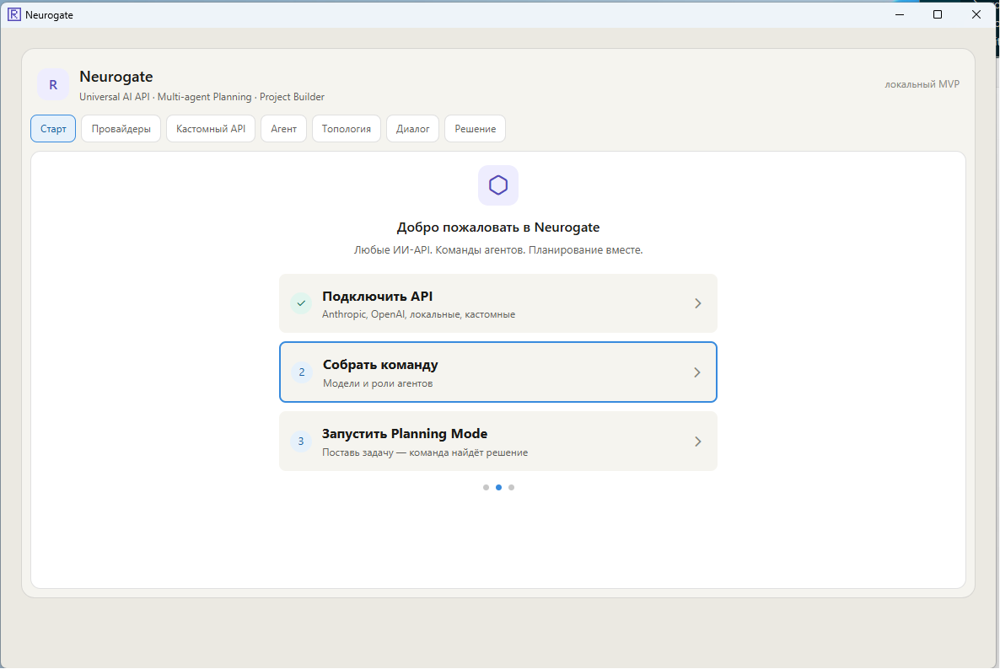
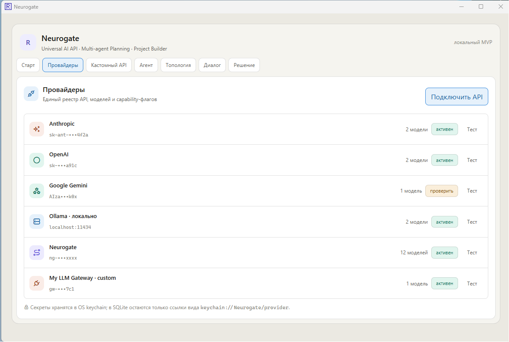
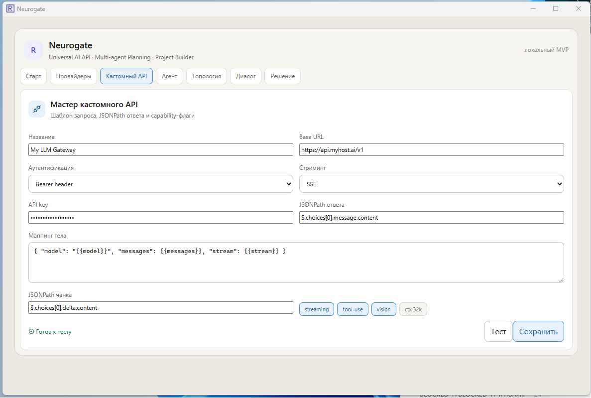
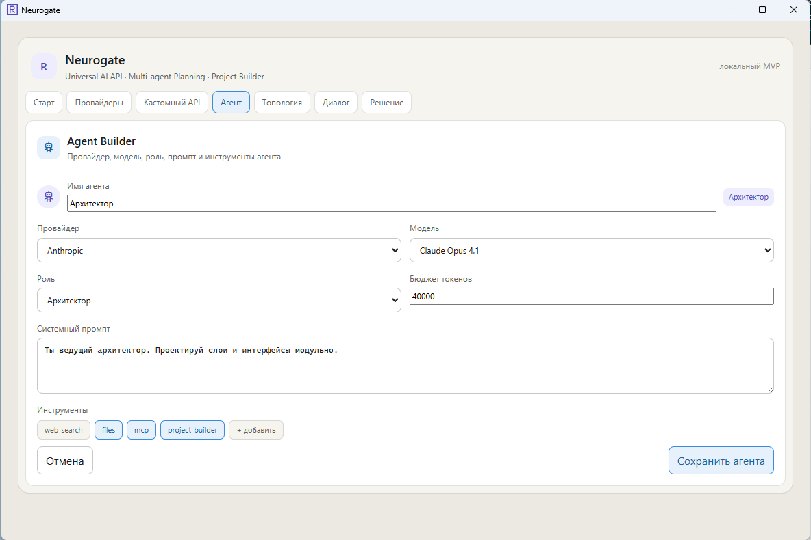
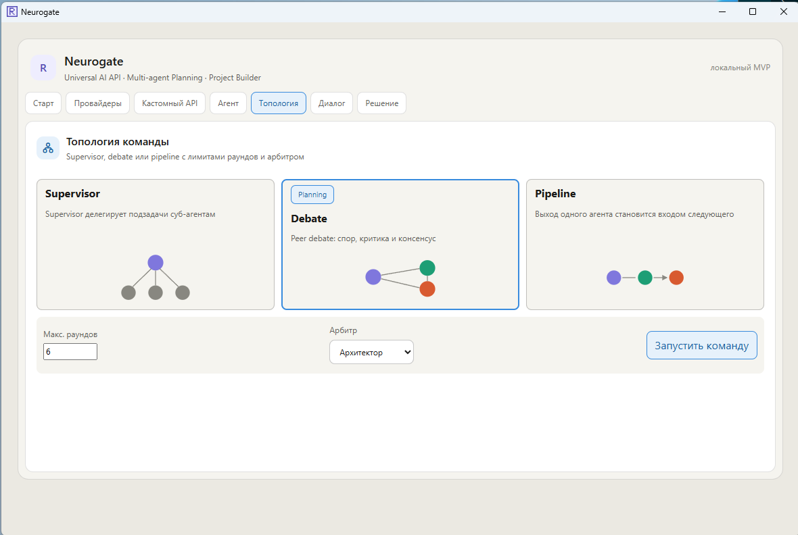
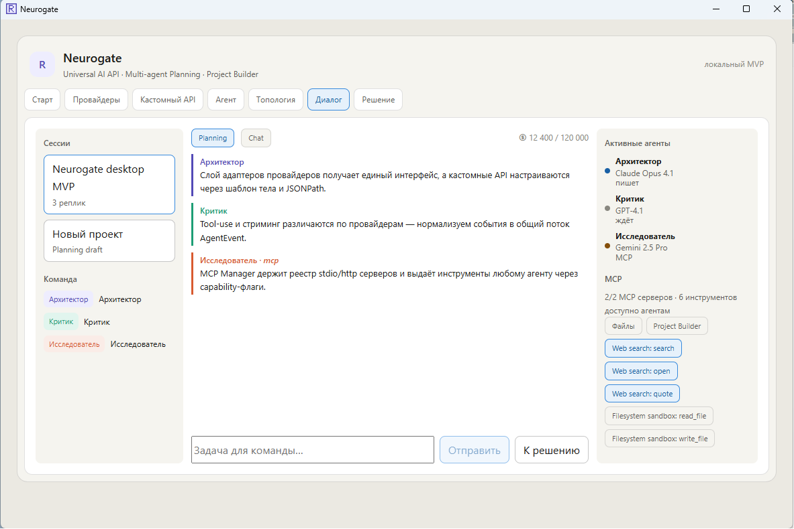
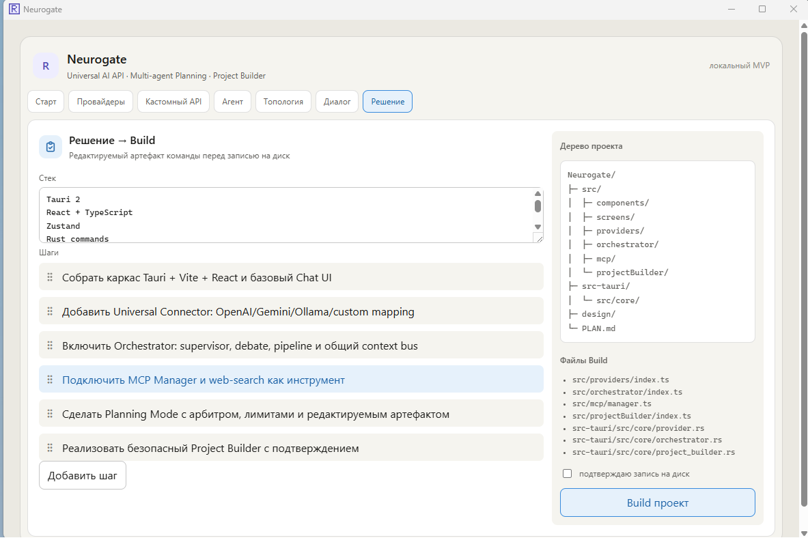

# Neurogate

Neurogate — настольный AI-клиент на **Tauri 2 + React + TypeScript** для подключения разных AI API, сборки команды агентов, multi-agent планирования и безопасной подготовки файлов проекта перед записью на диск.

Проект задуман как локальный MVP универсального AI-оркестратора: один интерфейс для провайдеров, кастомных API, ролей агентов, топологий команды, диалога и build-артефакта.

## Возможности

- единый реестр провайдеров: Anthropic, OpenAI, Google Gemini, локальный Ollama, Neurogate и кастомные gateway/API;
- мастер кастомного API с настройкой Base URL, авторизации, шаблона тела запроса, JSONPath ответа и JSONPath streaming-чанка;
- Agent Builder: выбор провайдера, модели, роли, системного промпта, бюджета токенов и доступных инструментов;
- несколько топологий команды: Supervisor, Debate и Pipeline;
- Planning Mode: командное обсуждение задачи несколькими агентами с активными ролями и MCP/tool-use;
- экран решения/Build: редактируемый стек, шаги сборки, дерево проекта и подтверждение записи на диск;
- хранение секретов через OS keychain, а не в открытом виде во frontend state.

## Скриншоты и описание экранов

### 1. Стартовый экран



Стартовый экран показывает основной сценарий работы: подключить API, собрать команду и запустить Planning Mode. Это не просто чат с одной моделью, а пошаговый вход в настройку AI-команды.

### 2. Провайдеры



Экран провайдеров — единый реестр API, моделей и capability-флагов. Здесь видно статус подключения, количество моделей и возможность тестировать провайдера. Секреты маскируются, а реальные ключи должны храниться в OS keychain.

### 3. Кастомный API



Мастер кастомного API позволяет подключать не только заранее поддержанные сервисы, но и собственный LLM Gateway. Настраиваются URL, тип авторизации, streaming-режим, шаблон тела запроса, JSONPath основного ответа и JSONPath чанков для стриминга.

### 4. Agent Builder



Agent Builder собирает отдельного агента: провайдер, модель, роль, бюджет токенов, системный промпт и инструменты. Это позволяет создавать специализированных участников команды — например архитектора, критика или исследователя.

### 5. Топология команды



Экран топологии выбирает способ взаимодействия агентов:

- **Supervisor** — главный агент делегирует подзадачи;
- **Debate** — агенты спорят, критикуют и сходятся к консенсусу;
- **Pipeline** — выход одного агента становится входом следующего.

Дополнительно задаются лимит раундов и арбитр, который помогает завершить обсуждение решением.

### 6. Диалог / Planning Mode



Planning Mode показывает сессии, реплики агентов, активную команду и доступные MCP-инструменты. В отличие от обычного AI-чата, пользователь видит не только ответ модели, но и распределение ролей, состояние агентов, tool-use и переход от обсуждения к решению.

### 7. Решение → Build



Экран Build превращает результат команды в редактируемый артефакт: стек, список шагов, дерево проекта и список файлов. Перед записью на диск требуется явное подтверждение — это снижает риск случайной перезаписи проекта.

## Чем Neurogate отличается от похожих программ

- **Не один чат, а команда агентов.** Neurogate фокусируется на ролях, топологии и командном планировании, а не только на переписке с одной моделью.
- **Провайдер-независимость.** В одном интерфейсе можно держать OpenAI/Anthropic/Gemini/Ollama/кастомные API и приводить их ответы к общему формату.
- **Кастомные API без переписывания кода.** JSONPath и шаблон тела запроса позволяют подключать совместимые и нестандартные LLM gateway.
- **Planning Mode перед Build.** Сначала команда обсуждает архитектуру и план, затем результат превращается в build-артефакт.
- **Безопасный Project Builder.** Запись файлов отделена от планирования и требует подтверждения пользователя.
- **Локальное desktop-приложение.** Tauri дает нативное окно и доступ к системным возможностям, при этом frontend остается на React/TypeScript.
- **MCP/tool-use как часть модели агентов.** Инструменты назначаются агентам через capability-флаги, а не существуют отдельно от командного процесса.

## Как запустить проект на Tauri

### Требования

Для Windows нужны:

1. **Node.js LTS** и npm.
2. **Rust** через `rustup`.
3. **Microsoft Visual Studio Build Tools** с компонентами C++ build tools.
4. **WebView2 Runtime** — обычно уже установлен в Windows 10/11.
5. Установленные зависимости проекта через `npm install`.

### Установка зависимостей

```bash
npm install
```

### Запуск web-версии для разработки

```bash
npm run dev
```

Vite dev server используется frontend-частью. В конфигурации Tauri проект ориентирован на локальный dev-сервер `http://127.0.0.1:1420`, чтобы не конфликтовать с другими Vite-проектами на стандартном порту `5173`.

### Запуск desktop-приложения Tauri

```bash
npm run tauri:dev
```

На Windows этот скрипт запускает `scripts\tauri-dev.bat`, который подготавливает окружение Visual Studio Build Tools, добавляет Rust/Cargo в `PATH` и вызывает `tauri dev`.

Если окружение уже настроено вручную, можно также использовать:

```bash
npm run tauri -- dev
```

или напрямую:

```bash
npx tauri dev
```

### Проверка типов и сборка frontend

```bash
npm run check
npm run build
```

### Production-сборка Tauri

```bash
npx tauri build
```

Готовые артефакты Tauri будут созданы в директории `src-tauri/target/release/bundle/`.

## Структура проекта

- `src/` — React UI, Zustand state, frontend-слои providers/orchestrator/MCP/project builder.
- `src-tauri/` — Rust/Tauri команды, keychain vault, SQLite history, MCP registry, project builder.
- `assets/screenshots/` — скриншоты для README.
- `design/` — эталонные standalone HTML-макеты и design tokens.
- `docs/neurogate.md` — актуальная линейка NeuroGate, коэффициенты и пример Claude Code config.
- `PLAN.md` — дорожная карта с отметками выполненных MVP-этапов.

## Команды разработки

```bash
npm install        # установить зависимости
npm run dev        # запустить Vite frontend
npm run check      # проверить TypeScript без сборки
npm run build      # собрать frontend
npm run tauri:dev  # запустить Tauri desktop в dev-режиме
npx tauri build    # собрать desktop-приложение
```

## Безопасность

- API-ключи не должны сохраняться в frontend state как постоянные значения: backend-команда пишет секреты в OS keychain и возвращает ссылку вида `keychain://Neurogate/<provider>`.
- Project Builder требует явного подтверждения пользователя перед записью файлов.
- История сообщений хранится в SQLite в app data директории.
- Не коммитьте реальные ключи, `.env` с секретами, приватные сертификаты и локальные конфиги.

